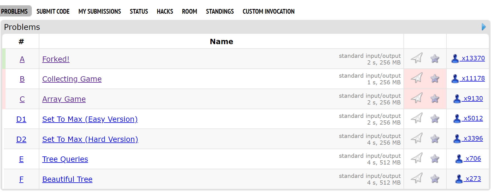

# 寒假算法集训（4）：图论基础

## A. 拓扑排序

对 DAG 进行的节点排序，使得$G(V,E)$中的任何有向边$(u,v)$在排序后仍有$u$在$v$前的性质；适用于处理依赖关系问题

### 实现

#### Khan BFS

- 设$S$, 找到所有入度为$0$的点入队$S$
- 任意取$S$中一点$v$, 减少其对应出边点上入度（即删边）
- 若这样的点入度变为$0$，同样入队$S$​
- 直到$S$为空为止

```c++
struct graph {
	vector<vector<ll>> G; // 邻接表
	vector<ll> in; // 入度
    
	ll n;
	graph(ll dimension) : n(dimension), G(dimension + 1),in(dimension + 1) {};
	void add_edge(ll from, ll to) {
		G[from].push_back(to);
		in[to]++;
	}
	bool topsort() {
		L.clear();
		queue<ll> S;
		ll ans = 0;
		for (ll i = 1; i <= n; i++) {
			if (in[i] == 0) S.push(i), dp[i] = 1;
		}
		while (!S.empty()) {
			ll v = S.front(); S.pop();
			L.push_back(v);	
			for (auto& out : G[v])
				if (--in[out] == 0)
					S.push(out);
		}
		return ((L.size() == n) ? true : false); // 当且仅当图为DAG时成立
	}
};
```

#### DFS

[OIWiki 链接](https://oi-wiki.org/graph/topo/#dfs-%E7%AE%97%E6%B3%95)

#### 笔记

- 统计各点深度（距离），可利用DP递推式：

  $dp[v] = max(dp[v], dp[u] + 1) \text { where (u,v) is a valid edge }$

#### [**Algo0401** Book](https://hydro.ac/d/ahuacm/p/Algo0401)

**分析：** 显然，读书顺序属于依赖关系问题；每读一次相当于深度+1，最后的读书次数即偏序后深度最大的点

不过，值得注意的是，读书顺序一定为从头到尾，即对应**顶点序号（即页码）一定递增**；由此，对 $(u,v)$，**如果$u > v$,这样的边不应该对深度产生贡献**

由此，新的递推式为

$dp[v] = \begin{cases} max(dp[v], dp[u] + 1) & \text{ where (u,v) is a valid edge and u < v } \\ dp[v] & \text{where (u,v) is a valid edge and u >= v} \end{cases}$

**CODE:**

```c++
struct graph {
	vector<v> G;
	v in;
	v L;
	ll n;
	
	v dp;
	
	graph(ll dimension) : n(dimension), G(dimension + 1),in(dimension + 1),dp(dimension + 1) {};
	void add_edge(ll from, ll to) {
		G[from].push_back(to);
		in[to]++;
	}
	bool topsort() {
		L.clear();
		queue<ll> S;
		ll ans = 0;
		for (ll i = 1; i <= n; i++) {
			if (in[i] == 0) S.push(i), dp[i] = 1;
		}
		while (!S.empty()) {
			ll v = S.front(); S.pop();
			L.push_back(v);	
			for (auto& out : G[v]) {
				if (--in[out] == 0)
					S.push(out);
				ll dist = out < v ? (dp[v] + 1) : dp[v];
				dp[out] = max(dp[out], dist);
			}
		}
		return ((L.size() == n) ? true : false);
	}

};
ll n;
int main() {
	ll t; cin >> t;
	while (t--)
	{
		ll n;  cin >> n;
		graph G(n);
		for (ll i = 1; i <= n; i++) {
			ll k; cin >> k;
			while (k--) {
				ll a; cin >> a;
				G.add_edge(a, i);
			}
		}
		if (G.topsort()) {
			ll ans = 0; for (ll depth : G.dp) ans = max(ans, depth);
			cout << ans << '\n';
		}
		else {
			cout << "-1\n";
		}
	}
}
```

#### [**Algo0402** 车站分级](https://hydro.ac/d/ahuacm/p/Algo0402)

**分析：** 对于包含停靠站的连续区间，之间**每一个停靠站**都是**每一个非停靠站**的依赖，由此即可构造DAG；之后就是统计最大深度了

**NOTE：** *话说拿邻接表做的时候MLE了一个点，后来查出来是重边吃了很多内存（*

*重边的存在与否显然不影响拓扑排序的结果；换成邻接矩阵以后就过了hh*

**CODE**:

```c++
struct graph {
	bool G[1001][1001]{};
	v in;
	v L;
	ll n;

	v dp;

	graph(ll dimension) : n(dimension), in(dimension + 1), dp(dimension + 1) {};
	void add_edge(ll from, ll to) {
		if (!G[from][to]) {
			G[from][to] = 1;
			in[to]++;
		}
	}
	bool topsort() {
		ll cnt = 0;
		queue<ll> S;
		ll ans = 0;
		for (ll i = 1; i <= n; i++) {
			if (in[i] == 0) S.push(i), dp[i] = 1;
		}
		while (!S.empty()) {
			ll v = S.front(); S.pop();
			cnt++;
			for (ll out = 1; out <= n; out++) {
				if (G[v][out]) {
					if (--in[out] == 0)
						S.push(out);
					ll dist = (dp[v] + 1);
					dp[out] = max(dp[out], dist);
				}
			}
		}
		return true; // ((cnt == n) ? true : false);
	}

};
ll n;
int main() {
	ll n, m;  cin >> n >> m;
	graph G(n);
	for (ll i = 1; i <= m; i++) {
		ll k; cin >> k;
		set<ll> st;
		ll st_min = 1e9, st_max = -1e9;
		while (k--) {
			ll a; cin >> a;
			st.insert(a);
			st_min = min(st_min, a);
			st_max = max(st_max, a);
		}
		for (ll j = st_min; j <= st_max; j++) {
			if (st.find(j) == st.end()) {
				for (auto s : st)
					G.add_edge(s, j);
			}
		}
	}
	if (G.topsort()) {
		ll ans = 0; for (ll depth : G.dp) ans = max(ans, depth);
		cout << ans << '\n';
	}
	else {
		cout << "-1\n";
	}
}
```
## B. 最短路

### Floyd 算法

DP解决任意两个顶点间的最短路；对顶点数时间复杂度为$O(N^3)$

[OIWiki 链接](https://oi-wiki.org/graph/shortest-path/#floyd-%E7%AE%97%E6%B3%95)

### 实现

在原图迭代，可以写成

- 记图$G[u][v]$，初始化各点为未连接；每个点即为$+inf$
- 对图中$G[v][v]$，初始化为自身连接，即为$0$
- 对边$(u,v) = w$，$w$为边权，记$G[u][v] = w$
- 递推过程如下

```c++
	for (ll k = 1; k <= n; k++) {
		for (ll i = 1; i <= n; i++) {
			for (ll j = 1; j <= n; j++) {
				G[i][j] = min(G[i][j], G[i][k] + G[k][j]);
			}
		}
	}
```

- 最后$G[i][j]$即为原图$i,j$间最短路

#### [**Algo0415** 【模板】Floyd 算法](https://hydro.ac/d/ahuacm/p/Algo0415)

**分析：** 注意构造的是无向图，给定$u,v$需要插入边$(u,v),(v,u)$

**CODE:**

```c++
ll F[DIM][DIM];
int main() {
	ll n, m; cin >> n >> m;
	memset(F, 63, sizeof(F));
	for (ll v = 1; v <= n; v++) F[v][v] = 0;
	while (m--) {
		ll u, v, w; cin >> u >> v >> w;
		F[u][v] = min(F[u][v], w);
		F[v][u] = min(F[v][u], w);
	}
	for (ll k = 1; k <= n; k++) {
		for (ll i = 1; i <= n; i++) {
			for (ll j = 1; j <= n; j++) {
				F[i][j] = min(F[i][j], F[i][k] + F[k][j]);
			}
		}
	}
	for (ll i = 1; i <= n; i++) {
		for (ll j = 1; j <= n; j++) {
			cout << F[i][j] << ' ';
		}
		cout << '\n';
	}
}
```

### Dijkstra 算法

摘自 [OIWiki](https://oi-wiki.org/graph/shortest-path/#dijkstra-%E7%AE%97%E6%B3%95)

> 将结点分成两个集合：已确定最短路长度的点集（记为 $S$ 集合）的和未确定最短路长度的点集（记为 $T$ 集合）。一开始所有的点都属于 $T$ 集合。
>
> 初始化 $dis(s) = 0$，其他点的 $dis$ 均为 $+inf$。
>
> 然后重复这些操作：
>
> 1. 从$T$ 集合中，选取一个最短路长度最小的结点，移到 $S$集合中。
> 2. 对那些刚刚被加入$S$ 集合的结点的所有出边执行松弛操作。
>
> 直到$T$​ 集合为空，算法结束。

### [**Algo0410** 【模板】单源最短路径（标准版）](https://hydro.ac/d/ahuacm/p/Algo0410)

**CODE:**

```c++
#define INF 1e18
struct edge { ll to, weight; };
struct vert { ll vtx, dis; };
struct graph {
	vector<vector<edge>> edges;
	vector<bool> vis;
	vector<ll> dis;	
	graph(const size_t verts) : edges(verts + 1), vis(verts + 1), dis(verts + 1) {
		fill(dis.begin(), dis.end(), INF);
	};
	void add_edge(ll u, ll v, ll w) {
		edges[u].emplace_back(edge{ v,w });
	}
	const auto& dijkstra(ll start) {
		const auto pp = PREDT(vert, lhs.dis > rhs.dis);
		priority_queue<vert, vector<vert>, decltype(pp)> T{ pp }; // 最短路点
		T.push(vert{ start, 0 });
		dis[start] = 0;
		while (!T.empty())
		{
			vert from = T.top(); T.pop();
			if (!vis[from.vtx]) {
				vis[from.vtx] = true;
				for (auto e : edges[from.vtx]) { // 松弛出边
					if (dis[e.to] > dis[from.vtx] + e.weight) {
						dis[e.to] = dis[from.vtx] + e.weight;
						T.push(vert{ e.to, dis[e.to] });
					}
				}
			}
		}
		return dis;
	}
};
```

### [**Algo0404** Moving Both Hands](https://hydro.ac/d/ahuacm/p/Algo0404)

**分析**: 把双手，开始分别在点$1,k$,最后移动到同一点$v$上，求移动最小距离和：即求$min(d(1,v) + d(k,v))$

转置图后，记反转后图中两点最短距离为$d'$，$\because d(i,j) = d'(j,i), \therefore d(1,v) + d(k,v) = d(1,v) + d'(v,k)$

把转置后的顶点和原图顶点以$0$权边相连后，构成新最短距$D$，即求$min(D(1,v) + D(v,k)) = D(1,k)$

**CODE:**

```c++
int main() {
	ll n, m; cin >> n >> m;
	graph G(n * 2);
	for (ll i = 1; i <= m; i++) {
		ll u, v, w; cin >> u >> v >> w;
		G.add_edge(u, v, w);
		G.add_edge(v + n, u + n, w);
	}
	for (ll i = 1; i <= n; i++) {
		G.add_edge(i, i + n, 0);
	}
	G.dijkstra(1);
	for (ll i = 2; i <= n; i++) {
		cout << (G.dis[i + n] != INF ? G.dis[i + n] : -1) << ' ';
	}
	return 0;
}
```

### C. 最小生成树 (MST)

### Kruskal 算法

摘自 [维基百科](https://zh.wikipedia.org/wiki/%E5%85%8B%E9%B2%81%E6%96%AF%E5%85%8B%E5%B0%94%E6%BC%94%E7%AE%97%E6%B3%95)

> 1. 新建图$G$，$G$中拥有原图中相同的节点，但没有边
> 2. 将原图中所有的边按权值从小到大排序
> 3. 从权值最小的边开始，如果这条边连接的两个节点于图$G$中不在同一个连通分量中，则添加这条边到图$G$中
> 4. 重复3，直至图$G$​中所有的节点都在同一个连通分量中

处理连通分量可以采用并查集

只有连通图才会有最小生成树；对$n$个顶点的连通图，此时Kruskal算法能且一定能找到$n-1$个权和最小的边将它们连接

#### [**Algo0411** 【模板】最小生成树](https://hydro.ac/d/ahuacm/p/Algo0411)

**CODE:**

```c++
struct dsu {
	vector<ll> pa;
	dsu(const ll size) : pa(size) { iota(pa.begin(), pa.end(), 0); }; // 初始时，每个集合都是自己的父亲
	inline bool is_root(const ll leaf) { return pa[leaf] == leaf; }
	inline ll find(const ll leaf) { return is_root(leaf) ? leaf : find(pa[leaf]); } // 路径压缩
	inline void unite(const ll x, const ll y) { pa[find(x)] = find(y); }
};
struct edge { ll from, to, weight; };
int main() {
	ll n, m; cin >> n >> m;
	vector<edge> edges(m);
	for (auto& edge : edges)
		cin >> edge.from >> edge.to >> edge.weight;
	sort(edges.begin(), edges.end(), PRED(lhs.weight < rhs.weight));
	dsu U(n + 1);
	ll ans = 0;
	ll cnt = 0;
	for (auto& edge : edges) {
		if (U.find(edge.from) != U.find(edge.to)) {
			U.unite(edge.from, edge.to);
			ans += edge.weight;
			cnt++;
		}
	}
	if (cnt == n - 1) cout << ans;
	else cout << "orz";
}
```

## D.欧拉回路（通路）

摘自 OIWiki:

>- **欧拉回路**：通过图中每条边恰好一次的回路
>- **欧拉通路**：通过图中每条边恰好一次的通路
>- **欧拉图**：具有欧拉回路的图
>- **半欧拉图**：具有欧拉通路但不具有欧拉回路的图

对应判别法有：

> 1. 无向图是欧拉图当且仅当：
>    - 非零度顶点是连通的
>    - 顶点的度数都是偶数
> 2. 无向图是半欧拉图当且仅当：
>    - 非零度顶点是连通的
>    - 恰有 2 个奇度顶点
> 3. 有向图是欧拉图当且仅当：
>    - 非零度顶点是强连通的
>    - 每个顶点的入度和出度相等
> 4. 有向图是半欧拉图当且仅当：
>    - 非零度顶点是弱连通的
>    - 至多一个顶点的出度与入度之差为 1
>    - 至多一个顶点的入度与出度之差为 1
>    - 其他顶点的入度和出度相等

#### Hierholzer 算法

即DFS找通路；注意这样回溯的结果是倒序的

这里的板子会处理好顺序；同时，如果不存在可能的欧拉回路或欧拉通路，返回`vector`为空

```c++
struct edge { ll to, weight; };
struct vert { ll vtx, dis; };
template<size_t Size> struct graph {
	bool G[Size][Size]{};
	ll in[Size]{};

	ll n;
	graph(const size_t verts) : n(verts) {};
	void add_edge(ll u, ll v) {
		G[u][v] = G[v][u] = true;
		in[v]++;
		in[u]++;
	}

	v euler_road_ans;
	v& euler_road(ll pa) {
		euler_road_ans.clear();
		ll odds = 0;
		for (ll i = 1; i <= n; i++) {
			if (in[i] % 2 != 0) 
				odds++;
		}
		if (odds != 0 && odds != 2) return euler_road_ans;
		const auto hierholzer = [&](ll x, auto& func) -> void {
			for (ll i = 1; i <= n; i++) {
				if (G[x][i]) {
					G[x][i] = G[i][x] = 0;
					func(i, func);
				}
			}
			euler_road_ans.push_back(x);
		};
		hierholzer(pa, hierholzer);
        reverse(euler_road_ans.begin(),euler_road_ans.end()
		return euler_road_ans;
	}
};
```

#### [**Algo0406** 无序字母对](https://hydro.ac/d/ahuacm/p/Algo0406)

**CODE:**

```c++
int main() {
	ll n; cin >> n;
	graph<256> G(255);
	while (n--) {
		string s; cin >> s;
		G.add_edge(s[0], s[1]);
	}
	ll in = INF;
	for (ll i = 1; i <= 255; i++) {
		if (G.in[i] % 2 != 0) {
			in = i; break; // 从奇度顶点出发
		}
	}
	if (in == INF) {
		for (ll i = 1; i <= 255; i++) {
			if (G.in[i]) in = i; break;
		}
	}
	auto& ans = G.euler_road(in);
	reverse(ans.begin(), ans.end());
	if (ans.size())
		for (char c : ans) cout << c;
	else
		cout << "No Solution";
	return 0;
}
```

#### [**Algo0407** 骑马修栅栏](https://hydro.ac/d/ahuacm/p/Algo0407)

**分析：** 两顶点间可能有多个栅栏，即有重边；同时一定有解，对板子稍作修改即可

**CODE:** 

```c++
struct edge { ll to, weight; };
struct vert { ll vtx, dis; };
template<size_t Size> struct graph {
	ll G[Size][Size]{};

	ll n;
	graph(const size_t verts) : n(verts) {};
	void add_edge(ll u, ll v) {
		G[u][v]++;
		G[v][u]++;
		in[v]++;
		in[u]++;
	}

	v euler_road_ans;
	v& euler_road(ll pa) {
		euler_road_ans.clear();
		const auto hierholzer = [&](ll x, auto& func) -> void {
			for (ll i = 1; i <= n; i++) {
				if (G[x][i]) {
					G[x][i]--;
					G[i][x]--;
					func(i, func);
				}
			}
			euler_road_ans.push_back(x);
			};
		hierholzer(pa, hierholzer);
		reverse(euler_road_ans.begin(), euler_road_ans.end());
		return euler_road_ans;
	}
};
int main() {
	ll n; cin >> n;
	graph<DIM + 1> G(DIM);
	while (n--) {
		ll u, v; cin >> u >> v;
		G.add_edge(u, v);
	}
	ll in = 1;
	for (ll i = 1; i <= DIM; i++) {
		if (G.in[i] % 2 != 0) {
			in = i; break; // 从奇度顶点出发
		}
	}
	auto& ans = G.euler_road(in);
	for (ll c : ans) cout << c << '\n';
	return 0;
}
```


## TBD

### CodeForces 训练

#### [Codeforces Round 914 (Div. 2)](https://codeforces.com/contest/1904)



#### A. Forked!

题意即求棋子位置交集；由此也小记 STL 中没怎么用过的[`std::set_intersection`](https://en.cppreference.com/w/cpp/algorithm/set_intersection)(cpp17+)

同时还有`std::set_union`,`std::set_difference`等

**CODE:** 

```c++
II offsets[] = { {1,1},{1,-1},{-1,-1},{-1,1} };
int main() {
	ll t; cin >> t;
	while (t--) {
		ll a, b; cin >> a >> b;
		ll xk, yk, xq, yq; cin >> xk >> yk >> xq >> yq;
		set<II> xyk, xyq;
		for (auto& offset : offsets) {
			xyk.insert(II{ xk + offset.first * a, yk + offset.second * b });
			xyk.insert(II{ xk + offset.first * b, yk + offset.second * a });
			xyq.insert(II{ xq + offset.first * a, yq + offset.second * b });
			xyq.insert(II{ xq + offset.first * b, yq + offset.second * a });
		}
		vector<II> intersect;
		set_intersection(xyk.begin(), xyk.end(), xyq.begin(), xyq.end(), std::back_inserter(intersect));
		cout << intersect.size() << '\n';
	}
}
```

### B. Collecting Game

应该是可以二分完成的题；但写的时候没调出来...就不放code了

### C. Array Game

### 总结

除了需要补齐的CF题目外，还有没能赶上ddl做出来的题

堆的有点太多了...看看下周能修好多少

 *时间管理大失败（*

#### [**Algo0403** Counting Shortcuts](https://hydro.ac/d/ahuacm/p/Algo0403)

TBD

####  [**Algo0405** Nearest Opposite Parity](https://hydro.ac/d/ahuacm/p/Algo0405)

TBD

#### [**Algo0408** 信息传递](https://hydro.ac/d/ahuacm/p/Algo0408)

TBD

####  [**Algo0409** 神经网络](https://hydro.ac/d/ahuacm/p/Algo0409)

TBD

####  [**Algo0412** 牛的旅行](https://hydro.ac/d/ahuacm/p/Algo0412)

TBD

### [**Algo0413** 飞行路线](https://hydro.ac/d/ahuacm/p/Algo0413)

TBD

### [**Algo0414** Building Roads S](https://hydro.ac/d/ahuacm/p/Algo0414)

TBD

---

to be continued...