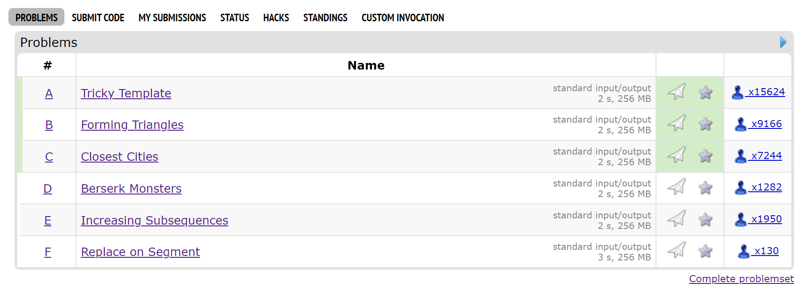
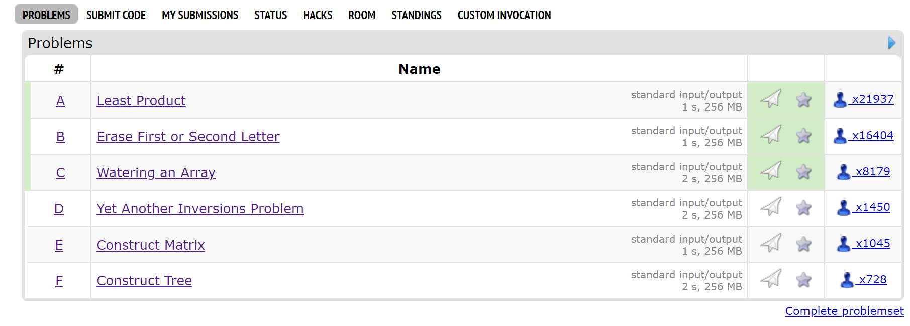
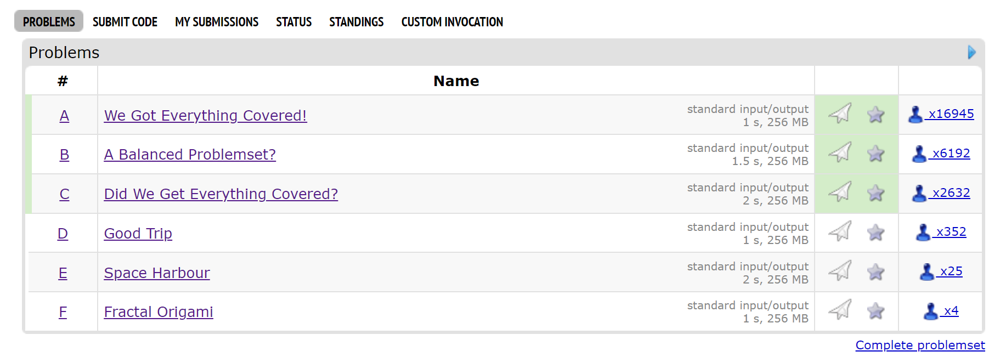

# 算法基础训练（4）：搜索

### JC0401. 自然数的拆分问题

**分析：** dfs+回溯，没什么槽点

**CODE:**

```c++
#define _CRT_SECURE_NO_WARNINGS
#include <iostream>
#include <algorithm>
#include <numeric>
#include <vector>
#include <stdio.h>
#include <cmath>
#include <queue>
using namespace std;
typedef long long ll;
typedef double lf;
typedef vector<ll> v;
#define EPS 0.0001F
#define PRED(X) [](auto const& lhs, auto const& rhs) {return X;}
#define PREDT(T,X) [](T const& lhs, T const& rhs) {return X;}
#define SUM(T,X)[](ll sum, T const& elem) { return X;}
#define PAIR2(T) pair<T,T>

#define DIMENSION 1e6
#define DIM (size_t)(DIMENSION)
ll buf[DIM];
void dfs(int index, int number) {
    if (number == 0) {
        if (index != 1) {
            for (int ii = 1; ii < index; ii++) {
                cout << buf[ii] << '+';
            }
            cout << buf[index] << '\n';
        }
    }
    else {
        for (int i = buf[index]; i <= number; i++) {
            buf[index + 1] = i;
            dfs(index + 1, number - i);
        }
    }
}

int main() {
    ll n;
    cin >> n;
    buf[0] = 1;
    dfs(0, n);
    return 0;
}
```

### JC0402. 八皇后问题

**分析：** dfs，注意剪枝和标记

剪枝即判断某地棋子能否放置即可

**CODE:**

```c++
#define _CRT_SECURE_NO_WARNINGS
#include <iostream>
#include <algorithm>
#include <numeric>
#include <vector>
#include <stdio.h>
#include <cmath>
#include <queue>
using namespace std;
typedef long long ll;
typedef double lf;
typedef vector<ll> v;
#define EPS 0.0001F
#define PRED(X) [](auto const& lhs, auto const& rhs) {return X;}
#define PREDT(T,X) [](T const& lhs, T const& rhs) {return X;}
#define SUM(T,X)[](ll sum, T const& elem) { return X;}
#define PAIR2(T) pair<T,T>

#define DIMENSION 1e6
#define DIM (size_t)(DIMENSION)
ll solution[20];
ll vis[20] = { 0 };
ll n;
ll num_solutions;
bool validate(int row, int col) {
    if (vis[col])
        return false;    
    for (ll rrow = 1; rrow < row; rrow++) {
        ll ccol = solution[rrow];        
        if (abs(row - rrow) == abs(col - ccol))
            return false;
    }
    return true;
}
void dfs(int row) {
    if (row > n) {
        if (num_solutions < 3) {
            for (ll ii = 1; ii < n; ii++) {
                cout << solution[ii] << ' ';
            }
            cout << solution[n] << '\n';
        }
        num_solutions++;
    }
    else {
        for (ll i = 1; i <= n; i++) {
            if (validate(row, i)) {
                solution[row] = i;
                vis[i] = 1;
                dfs(row + 1);
                vis[i] = 0;
            }
        }
    }
}
int main() {
    // std::ios::sync_with_stdio(false);
    cin >> n;
    dfs(1);
    cout << num_solutions;
    return 0;
}
```

### JC0403. Lake Counting S

**分析：** 填充题，和下一题差不多

填充即dfs过程中标记走过的结点,防止二次搜索

**CODE:**

```c++
#define _CRT_SECURE_NO_WARNINGS
#include <iostream>
#include <algorithm>
#include <numeric>
#include <vector>
#include <stdio.h>
#include <cmath>
#include <queue>
using namespace std;
typedef long long ll;
typedef double lf;
typedef vector<ll> v;
#define EPS 0.0001F
#define PRED(X) [](auto const& lhs, auto const& rhs) {return X;}
#define PREDT(T,X) [](T const& lhs, T const& rhs) {return X;}
#define SUM(T,X)[](ll sum, T const& elem) { return X;}
#define PAIR2(T) pair<T,T>

#define DIMENSION 1e6
#define DIM (size_t)(DIMENSION)
bool M[200][200];
ll n, m;
void dfs(int row, int col) {
    M[row][col] = false;
    for (int dy = -1; dy <= 1; dy++) {
        for (int dx = -1; dx <= 1; dx++)
        {
            if (dx == 0 && dy == 0) continue;
            if (M[row + dy][col + dx]) {
                dfs(row + dy, col + dx);
            }
        }
    }
}
int main() {
    // std::ios::sync_with_stdio(false);
    cin >> n >> m;
    ll ans = 0;
    string s;
    for (int row = 1; row <= n; row++) {
        cin >> s;
        for (int col = 1; col <= m; col++) {
            M[row][col] = s[col - 1] == 'W';
        }
    }
    for (int row = 1; row <= n; row++) {
        for (int col = 1; col <= m; col++) {
            if (M[row][col]) {
                dfs(row, col);
                ans++;
            }
        }
    }
    cout << ans;
    return 0;
}
```

### JC0404. 拯救oibh总部

**分析：** 同样还是填充题；最后遍历一遍填完的区域就可以算出答案

**CODE:**

```c++
#define _CRT_SECURE_NO_WARNINGS
#include <iostream>
#include <algorithm>
#include <numeric>
#include <vector>
#include <stdio.h>
#include <cmath>
#include <queue>
using namespace std;
typedef long long ll;
typedef double lf;
typedef vector<ll> v;
#define EPS 0.0001F
#define PRED(X) [](auto const& lhs, auto const& rhs) {return X;}
#define PREDT(T,X) [](T const& lhs, T const& rhs) {return X;}
#define SUM(T,X)[](ll sum, T const& elem) { return X;}
#define PAIR2(T) pair<T,T>

#define DIMENSION 1e6
#define DIM (size_t)(DIMENSION)
int M[600][600];
ll n, m;
void dfs(int row, int col) {
    if (row<0 || row> n + 1 || col<0 || col>m + 1 || M[row][col]) return;
    M[row][col] = 2;
    const auto walk = [&](int dx, int dy) {
        dfs(row + dy, col + dx);
    };
    walk(-1, 0);
    walk(1, 0);
    walk(0, 1);
    walk(0, -1);        
}
int main() {
    // std::ios::sync_with_stdio(false);
    cin >> n >> m;
    string s;
    for (int row = 1; row <= n; row++) {
        cin >> s;
        for (int col = 1; col <= m; col++) {
            M[row][col] = s[col - 1] == '*';
        }
    }
    dfs(0,0);
    ll ans = 0;
    for (int row = 1; row <= n; row++) {
        for (int col = 1; col <= m; col++) {
            if (M[row][col] == 0) {
                ans++;
            }
        }
    }
    cout << ans;
    return 0;
}
```

### JC0407. Catch That Cow S

**分析：** *某种程度上来说也算个dp？*

因为求的还是搜索深度（行走步数），采用bfs是个更为显然的选择

bfs实现利用`std::queue`即可

同时，还需要对步数进行记忆;否则会重复算很多东西

**CODE:**

```c++
#define _CRT_SECURE_NO_WARNINGS
#include <iostream>
#include <algorithm>
#include <numeric>
#include <vector>
#include <stdio.h>
#include <cmath>
#include <queue>
#include <iomanip>
using namespace std;
typedef long long ll;
typedef double lf;
typedef vector<ll> v;
#define EPS 0.0001F
#define PRED(X) [](auto const& lhs, auto const& rhs) {return X;}
#define PREDT(T,X) [](T const& lhs, T const& rhs) {return X;}
#define SUM(T,X)[](ll sum, T const& elem) { return X;}
#define PAIR2(T) pair<T,T>
typedef PAIR2(ll) II;
#define DIMENSION 3e5
#define DIM (size_t)(DIMENSION)
void solve(int from,int to) {
    queue<int> bfs;
    bfs.push(from);
    int moves[DIM]{};    
    const auto move_next = [&](int pos) {
        if (pos >= 0 && pos <= to * 3 && !moves[pos]) {
            bfs.push(pos);
            return true;
        }
        return false;
    };
    while (bfs.size()) {
        int pos = bfs.front();
        bfs.pop();
        if (pos == to) {
            cout << moves[pos] << '\n';
            return;
        }        
        if (move_next(pos - 1)) moves[pos - 1] = moves[pos] + 1;
        if (move_next(pos + 1)) moves[pos + 1] = moves[pos] + 1;
        if (move_next(pos * 2)) moves[pos * 2] = moves[pos] + 1;
    }
}
int main() {
    // std::ios::sync_with_stdio(false);
    int t, x, y;
    cin >> t;
    while (t--) {
        cin >> x >> y;
        solve(x, y);
    }    
    return 0;
}
```

### JC0408. 马的遍历

**分析：** 嗯..象棋。（没下过啊

不过马走日倒是知道的；和上一题一样，bfs找步数，并记忆结果

**CODE:**

```c++
#define _CRT_SECURE_NO_WARNINGS
#include <iostream>
#include <algorithm>
#include <numeric>
#include <vector>
#include <stdio.h>
#include <cmath>
#include <queue>
#include <iomanip>
using namespace std;
typedef long long ll;
typedef double lf;
typedef vector<ll> v;
#define EPS 0.0001F
#define PRED(X) [](auto const& lhs, auto const& rhs) {return X;}
#define PREDT(T,X) [](T const& lhs, T const& rhs) {return X;}
#define SUM(T,X)[](ll sum, T const& elem) { return X;}
#define PAIR2(T) pair<T,T>
typedef PAIR2(ll) II;
#define DIMENSION 1e6
#define DIM (size_t)(DIMENSION)
ll n, m, x, y;
ll M[600][600];
bool vis[600][600];
const II offsets[] = {II{2,1},II{1,2},II{-1,2},II{-2,1},II{-2,-1},II{-1,-2},II{1,-2},II{2,-1}};
int main() {
    // std::ios::sync_with_stdio(false);
    cin >> n >> m >> x >> y;
    M[x][y] = 0;
    vis[x][y] = 1;
    queue<II> bfs;
    bfs.push({ x,y });
    while (!bfs.empty()) {
        II pos = bfs.front();
        bfs.pop();
        for (const auto& offset : offsets) {
            II ppos = { pos.first + offset.first, pos.second + offset.second };
            if ((ppos.first >= 1 && ppos.first <= n) && (ppos.second >= 1 && ppos.second <= m) && !vis[ppos.first][ppos.second])
            {
                vis[ppos.first][ppos.second] = 1;
                bfs.push(ppos);
                M[ppos.first][ppos.second] = M[pos.first][pos.second] + 1;
            }
        }
    }
    for (ll row = 1; row <= n; row++) {
        for (ll col = 1; col <= m; col++) {
            cout << setw(5) << (vis[row][col] ? M[row][col] : -1);
        }
        cout << '\n';
    }
    return 0;
}
```

# CodeForces VP

随迟但到的cf初体验...

原来vp参赛的时候看不到tag/star；不过即使看solve人数就知道自己能走到哪了..

果然，只能做掉A\B\C..同时也有需要看tutorial的题目在内

不过vp之外能看tag...嗯，后面的题确实涉及到目前没学到的神奇知识

（学了以后就会写了吧...

姑且先把这些题的tag留在这里以后看（画饼中...）

## Day 1: https://codeforces.com/contest/1922



### A. Tricky Template

模拟题，没什么能说的地方

直接上code吧

```c++
#define _CRT_SECURE_NO_WARNINGS
#include <iostream>
#include <algorithm>
#include <numeric>
#include <vector>
#include <stdio.h>
#include <cmath>
#include <queue>
#include <iomanip>
using namespace std;
typedef long long ll;
typedef double lf;
typedef vector<ll> v;
#define EPS 0.0001F
#define PRED(X) [](auto const& lhs, auto const& rhs) {return X;}
#define PREDT(T,X) [](T const& lhs, T const& rhs) {return X;}
#define SUM(T,X)[](ll sum, T const& elem) { return X;}
#define PAIR2(T) pair<T,T>
typedef PAIR2(ll) II;
#define DIMENSION 3e5
#define DIM (size_t)(DIMENSION)

int main() {
	ll t; cin >> t;
	while (t--) {
		ll n; cin >> n;
		string a, b, c; cin >> a >> b >> c;
		bool ok = false;
		for (ll i = 0; i < n; i++) {
			if (a[i] != c[i] && b[i] != c[i]) { ok = true; break; }
		}
		if (ok) cout << "YES\n";
		else cout << "NO\n";
	}
}
```

### B. Forming Triangles

TL;DR - 两边之和大于第三边

不过，这点观察还不够；因为给定的边长都是$2$的$n$次幂，即$2^a,2^b,2^c$

- 若不等边，假定$a>=b>=c$，那么有

​	$2^a < 2^b + 2^c < 2^{b+1}$

​	即

​	$a < b + 1$

​	同时$a>=b$，即$a=b$

这点还是很新奇的..

- 若等边，显然 $ a = b = c $

综上，找三角形即找到所有值相等且至少成双的边长组合

接下来的逻辑还是看码吧...比较简单

```c++
#define _CRT_SECURE_NO_WARNINGS
#include <iostream>
#include <algorithm>
#include <numeric>
#include <vector>
#include <stdio.h>
#include <cmath>
#include <queue>
#include <iomanip>
#include <map>
using namespace std;
typedef long long ll;
typedef double lf;
typedef vector<ll> v;
#define EPS 0.0001F
#define PRED(X) [](auto const& lhs, auto const& rhs) {return X;}
#define PREDT(T,X) [](T const& lhs, T const& rhs) {return X;}
#define SUM(T,X)[](ll sum, T const& elem) { return X;}
#define PAIR2(T) pair<T,T>
typedef PAIR2(ll) II;
#define DIMENSION 3e5
#define DIM (size_t)(DIMENSION)
 
int main() {
	ll t; cin >> t;
	while (t--) {
		ll n; cin >> n;
		map<ll, ll> count;
		while (n--) {
			ll x; cin >> x; count[x]++;
		}
		map<ll, ll> csum;
		ll sum = 0;
		for (auto& [len, cnt] : count) {
			csum[len] = sum;
			sum += cnt;
		}
		ll ans = 0;
		for (auto& [len, cnt] : count) {
			if (cnt >= 2) {
				// {cnt}C{2} * \sum{1,len -1}count[i]
				ans += ((cnt * (cnt - 1)) / 2) * csum[len];
			}
			if (cnt >= 3) {
				// {cnt}C{3}
				ans += ((cnt * (cnt - 1) * (cnt - 2)) / 6);
			}
		}
		cout << ans << '\n';
	}
}
```

### C.Closest Cities

贪心。局部最优很简单，就是如果能到边领城市而且不会走回头路，就这样走；反之以距离计费

嗯，query也是区间形式...那就用前缀和吧

```c++
#define _CRT_SECURE_NO_WARNINGS
#include <iostream>
#include <algorithm>
#include <numeric>
#include <vector>
#include <stdio.h>
#include <cmath>
#include <queue>
#include <iomanip>
#include <map>
using namespace std;
typedef long long ll;
typedef double lf;
typedef vector<ll> v;
#define EPS 0.0001F
#define PRED(X) [](auto const& lhs, auto const& rhs) {return X;}
#define PREDT(T,X) [](T const& lhs, T const& rhs) {return X;}
#define SUM(T,X)[](ll sum, T const& elem) { return X;}
#define PAIR2(T) pair<T,T>
typedef PAIR2(ll) II;
#define DIMENSION 3e5
#define DIM (size_t)(DIMENSION)
ll cities[DIM], psum[DIM], rev_psum[DIM];
int main() {
	ll t; cin >> t;
	while (t--) {
		ll n,m; cin >> n;
		for (ll i = 1; i <= n; i++) cin >> cities[i];	
		cities[0] = cities[n + 1] = 0xffffffff;
		const auto get_closest = [&](ll i) {
			if (abs(cities[i + 1] - cities[i]) < abs(cities[i - 1] - cities[i])) return i + 1;
			return i - 1;
		};
		// 1 -> n
		for (ll i = 1; i <= n; i++) {
			if (i == 1) psum[i] = 0;
			else if (get_closest(i - 1) == i) psum[i] = psum[i - 1] + 1;
			else psum[i] = psum[i - 1] + abs(cities[i] - cities[i - 1]);
		}
		// n -> 1
		for (ll i = n; i >= 1; i--) {
			if (i == n) rev_psum[i] = 0;
			else if (get_closest(i + 1) == i) rev_psum[i] = rev_psum[i + 1] + 1;
			else rev_psum[i] = rev_psum[i + 1] + abs(cities[i + 1] - cities[i]);
		}
		cin >> m;
		while (m--) {
			ll x, y; cin >> x >> y;
			if (y > x) cout << psum[y] - psum[x] << '\n';
			else  cout << rev_psum[y] - rev_psum[x] << '\n';
		}
	}
}
```

---

然后就是暂时没法做的题...

### D. Berserk Monsters

*tag:并查集*

### E. Increasing Subsequences

*tag:分治/贪心*

### F. Replace on Segment

*tag:DP,2500*

## Day2: https://codeforces.com/contest/1917


### A. Least Product

很简单的数学问题，负负得正；有奇数个数负数或0就不用改，反之清零
```c++
#define _CRT_SECURE_NO_WARNINGS
#include <iostream>
#include <algorithm>
#include <numeric>
#include <vector>
#include <stdio.h>
#include <cmath>
#include <queue>
#include <iomanip>
#include <map>
using namespace std;
typedef long long ll;
typedef double lf;
typedef vector<ll> v;
#define EPS 0.0001F
#define PRED(X) [](auto const& lhs, auto const& rhs) {return X;}
#define PREDT(T,X) [](T const& lhs, T const& rhs) {return X;}
#define SUM(T,X)[](ll sum, T const& elem) { return X;}
#define PAIR2(T) pair<T,T>
typedef PAIR2(ll) II;
#define DIMENSION 3e5
#define DIM (size_t)(DIMENSION)
ll cities[DIM], psum[DIM], rev_psum[DIM];
int main() {
	ll t; cin >> t;
	while (t--) {
		ll n; cin >> n;
		ll positive = 0, negative = 0, zeros = 0;
		while (n--) {
			ll x; cin >> x;
			if (x == 0) zeros++;
			if (x > 0) positive++;
			if (x < 0) negative++;
		}
		if (negative % 2 == 1 || zeros) cout << "0\n";
		else cout << "1\n1 0\n";
	}
}
```
### B. Erase First or Second Letter
为什么会在这里卡...
tag里有dp，但是没能从这个方向写出来...
无奈看tutorial，发现评论区有个很妙的方法 (https://codeforces.com/blog/entry/123721?#comment-1097086)

- 长度$1$~$n$的字串,若排列一定且不重复（即仅长度不同）很显然有$\sum_{1}^{n} = (n+1)(n)/2$种

- 如此，发现所有*重复*的字符，处理掉它们不应该有的贡献即可

```c++
#define _CRT_SECURE_NO_WARNINGS
#include <iostream>
#include <algorithm>
#include <numeric>
#include <vector>
#include <stdio.h>
#include <cmath>
#include <queue>
#include <iomanip>
#include <map>
using namespace std;
typedef long long ll;
typedef double lf;
typedef vector<ll> v;
#define EPS 0.0001F
#define PRED(X) [](auto const& lhs, auto const& rhs) {return X;}
#define PREDT(T,X) [](T const& lhs, T const& rhs) {return X;}
#define SUM(T,X)[](ll sum, T const& elem) { return X;}
#define PAIR2(T) pair<T,T>
typedef PAIR2(ll) II;
#define DIMENSION 3e5
#define DIM (size_t)(DIMENSION)
ll dp[DIM];
int main() {
	ll t; cin >> t;
	while (t--) {
		ll n; cin >> n;
		string s; cin >> s;
		ll ans = (n + 1) * n / 2;
		map<char, ll> occur;
		for (ll i = 0; i < n; i++) {
			if (!occur.contains(s[i])) occur[s[i]] = i;
			else {
				ans -= n - i;
			}
		}
		cout << ans << '\n';
	}
}
```

### C. Watering an Array

暴力搜索

局部最优即某一天后，add 1天reset 1天重复；问题即找到这样的一天即可

```c++
#define _CRT_SECURE_NO_WARNINGS
#include <iostream>
#include <algorithm>
#include <numeric>
#include <vector>
#include <stdio.h>
#include <cmath>
#include <queue>
#include <iomanip>
#include <map>
using namespace std;
typedef long long ll;
typedef double lf;
typedef vector<ll> v;
#define EPS 0.0001F
#define PRED(X) [](auto const& lhs, auto const& rhs) {return X;}
#define PREDT(T,X) [](T const& lhs, T const& rhs) {return X;}
#define SUM(T,X)[](ll sum, T const& elem) { return X;}
#define PAIR2(T) pair<T,T>
typedef PAIR2(ll) II;
#define DIMENSION 1e6
#define DIM (size_t)(DIMENSION)
ll A[DIM], V[DIM];
int main() {
	ll t; cin >> t;
	while (t--) {
		ll n, k, d; cin >> n >> k >> d;
		ll mans = 0;
		for (ll i = 1; i <= n; i++) cin >> A[i];
		for (ll i = 0; i < k; i++) cin >> V[i];
		for (ll i = 1; i <= d && i <= 2 * n; i++) {
			ll ans = 0;
			for (ll j = 1; j <= n; j++) {
				ans += A[j] == j;
			}
			// reap at day i
			// it's the most optimal to do op1 then do op2 for every two days
			// yields 1 point per two days
			ans += (d - i) / 2;
			mans = max(ans, mans);
			// prepare for the next loop
			for (ll j = 1; j <= V[(i-1) % k]; j++) {
				A[j]++;
			}
		}
		cout << mans << '\n';
	}
}
```

---

### D. Yet Another Inversions Problem

*tag: dp,数论,2300*

### E. Construct Matrix

*tag: 数学,2500*

### F. Construct Tree

*tag: dp,树,2500*

### Day3: https://codeforces.com/contest/1925



### A. We Got Everything Covered!

发现含用前$k$个字母组成长$n$的所有字串的字符串最短长$nk$，重复输出即可

```c++
#define _CRT_SECURE_NO_WARNINGS
#include <iostream>
#include <algorithm>
#include <numeric>
#include <vector>
#include <stdio.h>
#include <cmath>
#include <queue>
#include <iomanip>
#include <map>
using namespace std;
typedef long long ll;
typedef double lf;
typedef vector<ll> v;
#define EPS 0.0001F
#define PRED(X) [](auto const& lhs, auto const& rhs) {return X;}
#define PREDT(T,X) [](T const& lhs, T const& rhs) {return X;}
#define SUM(T,X)[](ll sum, T const& elem) { return X;}
#define PAIR2(T) pair<T,T>
typedef PAIR2(ll) II;
#define DIMENSION 1e6
#define DIM (size_t)(DIMENSION)
ll A[DIM], V[DIM];
int main() {
	ll t; cin >> t;
	while (t--) {
		ll n, k; cin >> n >> k;
		for (ll i = 0; i < n; i++) {
			for (char j = 0; j < k; j++) {
				cout << (char)('a' + j);
			}
		}
		cout << '\n';
	}
}
```

### B.  A Balanced Problemset?

没找到突破口，还是翻tutorial了..

由此发现了一个比较显然的gcd事实：$gcd(a_1,a_2,a_3...) = gcd(a_1,a_1 + a_2,a_1+a_2+a_3...)$

题目找的就是全体$a_i$的gcd，而且$\sum{a_i} = x$；找最大$gcd$不就是找某个最大的$d$,$x = kd$吗

嗯，直接搜索吧

```c++
#define _CRT_SECURE_NO_WARNINGS
#include <iostream>
#include <algorithm>
#include <numeric>
#include <vector>
#include <stdio.h>
#include <cmath>
#include <queue>
#include <iomanip>
#include <map>
using namespace std;
typedef long long ll;
typedef double lf;
typedef vector<ll> v;
#define EPS 0.0001F
#define PRED(X) [](auto const& lhs, auto const& rhs) {return X;}
#define PREDT(T,X) [](T const& lhs, T const& rhs) {return X;}
#define SUM(T,X)[](ll sum, T const& elem) { return X;}
#define PAIR2(T) pair<T,T>
typedef PAIR2(ll) II;
#define DIMENSION 1e6
#define DIM (size_t)(DIMENSION)
ll A[DIM], V[DIM];
int main() {
	ll t; cin >> t;
	while (t--) {
		ll x, n; cin >> x >> n;
		ll ans = 1;
		for (ll d = 1; d <= sqrt(x) + 1; d++) {
			if (x % d == 0 && n * d <= x) {
				ans = max(ans, d);
			}
			if (x % d == 0 && n <= d) {
				ans = max(ans, x/d);
			}
		}
		cout << ans << '\n';
	}
}
```

### C. Did We Get Everything Covered?

这题是A的judge？

贪心策略：对字串拿最晚出现的独立字母做反例

具体实现不是很复杂，看码也能一眼望穿

```c++
#define _CRT_SECURE_NO_WARNINGS
#include <iostream>
#include <algorithm>
#include <numeric>
#include <vector>
#include <stdio.h>
#include <cmath>
#include <queue>
#include <iomanip>
#include <map>
using namespace std;
typedef long long ll;
typedef double lf;
typedef vector<ll> v;
#define EPS 0.0001F
#define PRED(X) [](auto const& lhs, auto const& rhs) {return X;}
#define PREDT(T,X) [](T const& lhs, T const& rhs) {return X;}
#define SUM(T,X)[](ll sum, T const& elem) { return X;}
#define PAIR2(T) pair<T,T>
typedef PAIR2(ll) II;
#define DIMENSION 1e6
#define DIM (size_t)(DIMENSION)
ll A[DIM], V[DIM];
int main() {
	ll t; cin >> t;
	while (t--) {
		ll n, k, m; cin >> n >> k >> m;
		string s; cin >> s;
		map<char, ll> occur;
		string edge;
		ll unique = 0;
		for (ll i = 0; i < s.length() && edge.length() < n; i++) {
			if (!occur.contains(s[i])) {
				unique++;
				occur[s[i]] = i;
			}
			if (unique >= k) {
				edge += s[i];
				occur.clear();
				unique = 0;
			}
		}
		if (edge.length() >= n) cout << "YES\n";
		else {
			cout << "NO\n";
			char miss = 0;
			for (ll i = 0; i < k && !miss; i++) {
				if (!occur.contains(i + 'a')) miss = i + 'a';
			}
			cout << edge;
			for (ll i = 0; i < n - edge.length(); i++) cout << miss;
			cout << '\n';
		}
	}
}
```

---

### D. Good Trip

*tag: 组合数,1750?*

### E. Space Harbour

*tag: 数学*,2500?

### F. Fractal Origami

*tag: 几何,3000?*

---

有点惨...这些题不知道哪天有能力可以补上
